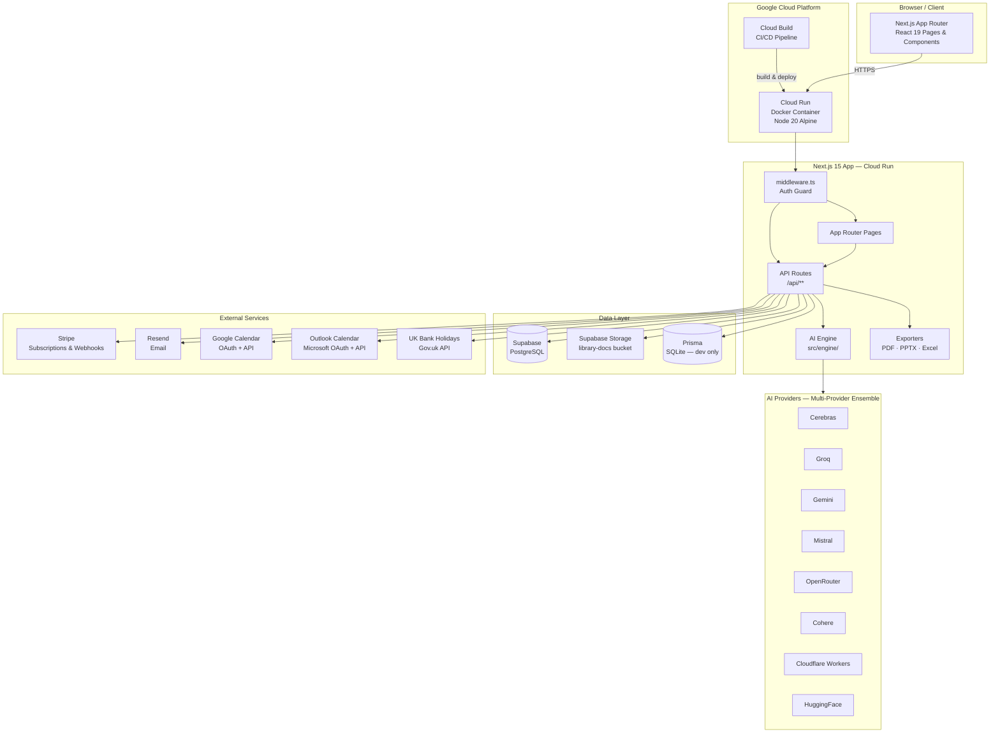
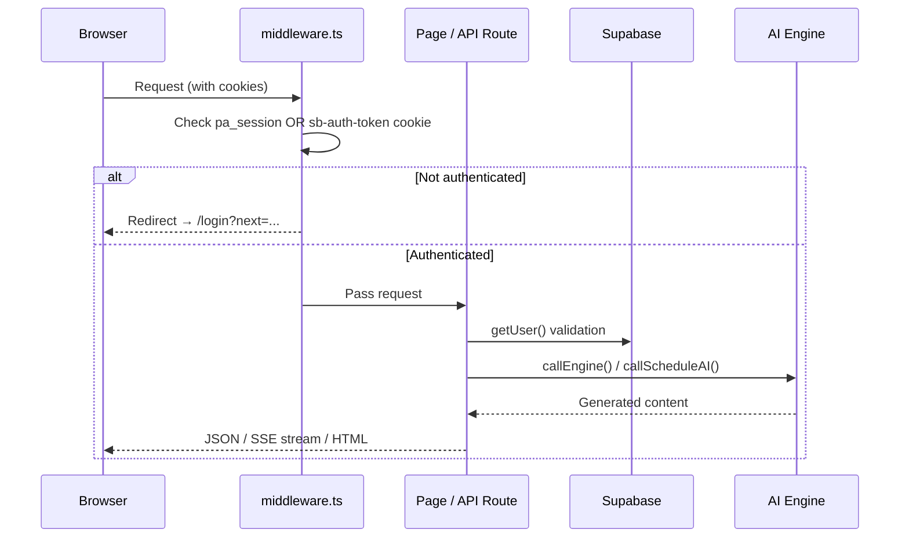
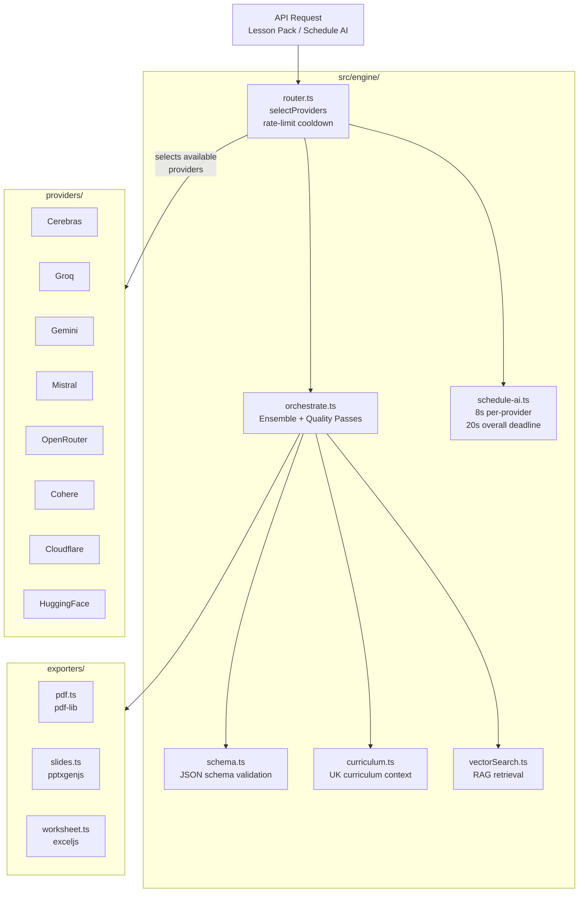
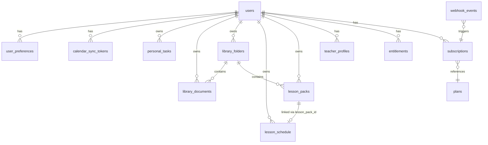
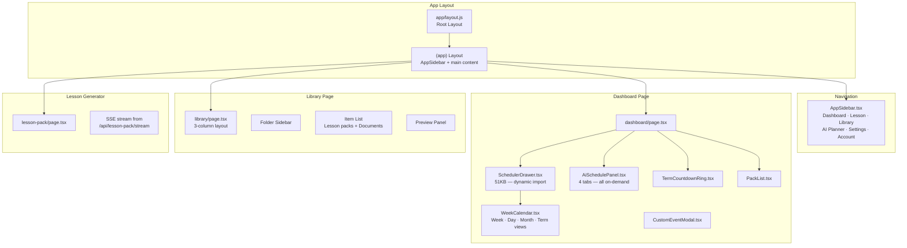
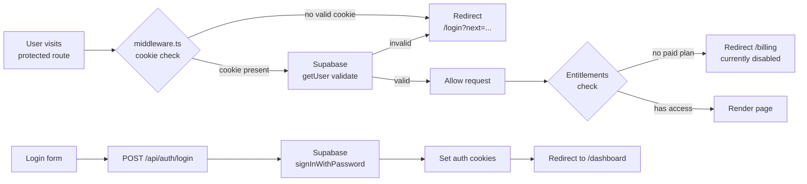
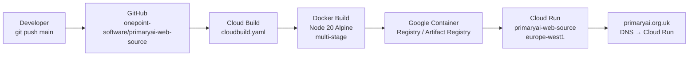

# PrimaryAI — Architecture Overview

> **Stack**: Next.js 15 · React 19 · Supabase · Stripe · Google Cloud Run
> **Domain**: https://primaryai.org.uk
> **Repo**: https://github.com/Onepoint-Software/primaryai-web-source

---

## High-Level Architecture



---

## Request Lifecycle



---

## Application Routes

### Protected Routes (`/app` group — requires auth)

| Route | Description |
|-------|-------------|
| `/dashboard` | Main teacher dashboard with scheduler, task list, AI panel |
| `/lesson-pack` | AI lesson pack generator |
| `/library` | Document library — folders, lesson packs, uploads |
| `/ai-planner` | Dedicated AI schedule planner (4 AI tools) |
| `/settings` | Term dates, calendar sync, preferences |
| `/account` | User profile |
| `/billing` | Stripe subscription management |
| `/profile-setup` | Onboarding profile wizard |
| `/survey-responses` | View survey data |

### Public Routes (`/public` group)

| Route | Description |
|-------|-------------|
| `/` | Marketing landing page |
| `/login` `/signup` | Auth forms |
| `/forgot-password` `/reset-password` | Password recovery |
| `/pricing` `/features` `/faq` `/contact` | Marketing pages |
| `/legal/privacy` `/legal/terms` | Legal pages |
| `/survey` | Public survey form |

### Other Routes

| Route | Description |
|-------|-------------|
| `/widget/countdown` | Embeddable countdown timer |
| `/preview/*` | Design/Figma previews (dev) |

---

## API Surface

### Auth (`/api/auth/`)

| Method | Endpoint | Purpose |
|--------|----------|---------|
| POST | `/api/auth/signup` | Register new user |
| POST | `/api/auth/login` | Email/password login |
| POST | `/api/auth/logout` | Logout (clears cookies) |
| POST | `/api/auth/forgot-password` | Initiate password reset |
| POST | `/api/auth/reset-password` | Confirm password reset |
| GET | `/api/auth/session` | Get current session |
| GET/POST | `/api/auth/google` | Google OAuth |
| GET | `/api/auth/google/callback` | Google OAuth callback |

### Schedule & Calendar

| Method | Endpoint | Purpose |
|--------|----------|---------|
| GET/POST | `/api/schedule` | List / create schedule events |
| GET/PUT/DELETE | `/api/schedule/[id]` | Single event CRUD |
| POST | `/api/schedule/[id]/generate-pack` | Generate lesson pack from event |
| GET | `/api/schedule/ai-summary` | AI weekly summary |
| POST | `/api/schedule/ai-plan` | AI schedule planner |
| GET | `/api/schedule/ai-gaps` | AI curriculum gap check |
| POST | `/api/schedule/ai-term-plan` | AI full-term plan generator |
| GET | `/api/calendar/bank-holidays` | UK bank holidays |
| GET | `/api/calendar/ics/[token]` | ICS calendar export |

### Google Calendar Sync

| Method | Endpoint | Purpose |
|--------|----------|---------|
| POST | `/api/schedule/google-connect` | Initiate OAuth |
| GET | `/api/schedule/google-callback` | OAuth callback |
| POST | `/api/schedule/google-import` | Import events |
| POST | `/api/schedule/google-backfill` | Backfill history |
| GET | `/api/schedule/google-status` | Sync status |
| POST | `/api/schedule/google-disconnect` | Revoke access |

### Outlook Calendar Sync

| Method | Endpoint | Purpose |
|--------|----------|---------|
| POST | `/api/schedule/outlook-connect` | Initiate OAuth |
| GET | `/api/schedule/outlook-callback` | OAuth callback |
| POST | `/api/schedule/outlook-import` | Import events |
| POST | `/api/schedule/outlook-backfill` | Backfill history |
| GET | `/api/schedule/outlook-status` | Sync status |
| POST | `/api/schedule/outlook-disconnect` | Revoke access |

### Lesson Packs

| Method | Endpoint | Purpose |
|--------|----------|---------|
| POST | `/api/lesson-pack` | Generate lesson pack |
| POST | `/api/lesson-pack/stream` | Stream generation (SSE) |
| POST | `/api/lesson-pack/parse-context` | Parse uploaded documents |
| POST | `/api/lesson-pack/export` | Export as PDF / PPTX / worksheet |
| GET | `/api/lesson-pack/providers` | List available AI providers |

### Library

| Method | Endpoint | Purpose |
|--------|----------|---------|
| GET/POST | `/api/library` | List / create lesson packs |
| GET/PUT/DELETE | `/api/library/[id]` | Single lesson pack |
| GET/POST | `/api/library/folders` | Folder CRUD |
| GET/PUT/DELETE | `/api/library/folders/[id]` | Single folder |
| GET/POST | `/api/library/documents` | Document list / upload |
| GET/PUT/DELETE | `/api/library/documents/[id]` | Single document (download/move/delete) |

### Billing

| Method | Endpoint | Purpose |
|--------|----------|---------|
| POST | `/api/checkout` | Create Stripe checkout session |
| GET | `/api/billing/portal` | Stripe billing portal link |
| GET | `/api/subscriptions/status` | Check subscription |
| POST | `/api/stripe/webhook` | Handle Stripe events |

---

## AI Engine



### Provider Selection Logic

- **8 LLM providers** registered; selected in priority order
- Providers with recent rate-limit errors are temporarily excluded (cooldown)
- Lesson pack generation: full ensemble + quality/alignment/finalization passes
- Schedule AI: max 3 providers, **8s per-provider timeout**, **20s overall deadline** — always on-demand, never auto-loaded

---

## Data Model



### Key Tables

| Table | Purpose |
|-------|---------|
| `users` | Core user accounts (Supabase auth) |
| `plans` | Subscription plan definitions |
| `subscriptions` | Active user subscriptions |
| `entitlements` | Feature flags per user |
| `webhook_events` | Stripe webhook event log |
| `teacher_profiles` | Teaching context: school, subjects, year groups, ability mix, EAL %, pupil premium %, approach |
| `lesson_packs` | Generated lesson content (JSON), linked to schedule events |
| `lesson_schedule` | Timed schedule events (date, start/end time, subject, year group) |
| `library_folders` | Folder hierarchy for library organisation |
| `library_documents` | Uploaded files (PDF, DOCX, images) — stored in Supabase Storage |
| `personal_tasks` | Teacher's personal to-do items |
| `calendar_sync_tokens` | Google / Outlook OAuth tokens |
| `user_preferences` | UI preferences |
| `curriculum_vectors` | Embedded curriculum content for RAG |
| `term_dates_settings` | School term start/end dates |

---

## Component Architecture



---

## Authentication Flow



**Cookie names:**
- `pa_session` — legacy JSON session cookie
- `sb-[project]-auth-token` — Supabase JWT (current)

---

## Calendar Sync Architecture

```mermaid
graph LR
    subgraph Google["Google Calendar"]
        GA[OAuth 2.0\nAuthorization]
        GI[Event Import\ngoogle-import]
        GS[Sync State\ngoogle_calendar_sync table]
    end

    subgraph Outlook["Outlook / Microsoft"]
        OA[MSAL OAuth\nAuthorization]
        OI[Event Import\noutlook-import]
        OS[Sync State\noutlook_calendar_sync table]
    end

    subgraph App["App Scheduler"]
        LE[lesson_schedule table\nevent_category:\noutlook_import | google_import]
        WC2[WeekCalendar.tsx\nImported events shown\nwith provider icon\nnon-draggable]
    end

    Google --> GS
    Outlook --> OS
    GS --> LE
    OS --> LE
    LE --> WC2
```

Imported events display with:
- **Outlook icon** (blue) for `event_category = "outlook_import"`
- **Google icon** (red) for `event_category = "google_import"`
- Non-draggable (locked to imported position)

---

## Deployment Pipeline



**Cloud Run config:**
- Region: `europe-west1`
- GCP Project: `primary-ai-saas`
- Service: `primaryai-web-source`
- Port: `8080`

**Env vars** are set on Cloud Run (not in git). To update without a code change:
```bash
gcloud run services update primaryai-web-source \
  --region=europe-west1 \
  --project=primary-ai-saas \
  --update-env-vars="KEY=VALUE"
```

---

## Key Environment Variables

| Variable | Purpose |
|----------|---------|
| `NEXT_PUBLIC_APP_URL` | Public app URL |
| `SUPABASE_URL` | Supabase project URL |
| `SUPABASE_ANON_KEY` | Supabase public anon key |
| `SUPABASE_SERVICE_ROLE_KEY` | Supabase admin key (server-side only) |
| `SUPABASE_DB_URL` | Direct database connection URL |
| `STRIPE_SECRET_KEY` | Stripe API key |
| `STRIPE_WEBHOOK_SECRET` | Stripe webhook signing secret |
| `STRIPE_PRICE_STARTER` | Stripe price ID for Starter plan |
| `CEREBRAS_API_KEY` | Cerebras LLM |
| `GROQ_API_KEY` | Groq LLM |
| `GEMINI_API_KEY` | Google Gemini |
| `MISTRAL_API_KEY` | Mistral |
| `OPENROUTER_API_KEY` | OpenRouter aggregator |
| `COHERE_API_KEY` | Cohere |
| `CLOUDFLARE_*` | Cloudflare Workers AI |
| `HUGGINGFACE_API_KEY` | HuggingFace Inference |
| `GOOGLE_CLIENT_ID/SECRET` | Google Calendar OAuth |
| `MICROSOFT_CLIENT_ID/SECRET` | Outlook Calendar OAuth |
| `RESEND_API_KEY` | Email service |
| `AUTH_SECRET` | NextAuth.js secret |

---

## Technology Stack Summary

| Layer | Technology |
|-------|-----------|
| Framework | Next.js 15 (App Router) |
| UI | React 19 |
| Language | TypeScript + JavaScript (mixed) |
| Database (prod) | Supabase (PostgreSQL) |
| Database (dev) | Prisma + SQLite |
| ORM | Prisma 6 |
| Auth | Supabase Auth + NextAuth.js beta |
| Storage | Supabase Storage |
| Billing | Stripe |
| Email | Resend |
| AI Providers | Cerebras, Groq, Gemini, Mistral, OpenRouter, Cohere, Cloudflare Workers, HuggingFace |
| Calendar | Google Calendar API + Microsoft Graph API |
| PDF Export | pdf-lib |
| PPTX Export | pptxgenjs |
| Excel Export | exceljs |
| DOCX Parsing | mammoth |
| Hosting | Google Cloud Run |
| CI/CD | Google Cloud Build |
| Container | Docker (Node 20 Alpine) |
| DNS | primaryai.org.uk |
